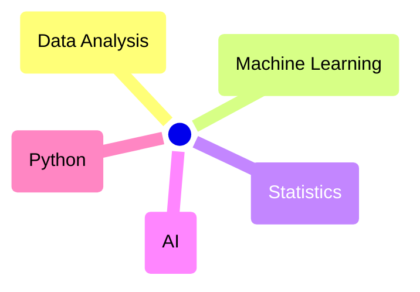

## Hi there 👋
I’m Mikel Imaz, an aspiring Data Science & AI professional based in Spain.

I hold a BSc in Physics and have a professional background in industrial automation. I’m passionate about interpreting reality, extracting meaningful insights from data, and communicating those insights with clarity.

Here's my reference stack:

I'm also familiar with:

I took my training courses at:

And got these certifications:

## :point_right: [Check out my works!](https://mikel-imaz.github.io/mikel-imaz/)
