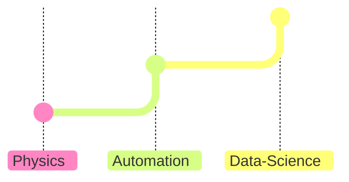

# About me

I hold a BSc in Physics and have a professional background in industrial automation.

Then I took up Data Science.  

I did most of my training on [:simple-datacamp:DataCamp](https://www.datacamp.com/portfolio/mikel-imaz){:target="_blank"}.  

Where I got these certifications(1)
{ .annotate }

1. [:simple-datacamp: &nbsp; __AI Engineer for Data Scientists__](https://www.datacamp.com/certificate/AEDS0014919391728 "See certificate"){:target="_blank"}  
   [:simple-datacamp: &nbsp; __Data Engineer Associate__](https://www.datacamp.com/certificate/DEA0019715243303 "See certificate"){:target="_blank"}  
   [:simple-datacamp: &nbsp; __Data Scientist Associate__](https://www.datacamp.com/certificate/DSA0010038401807 "See certificate"){:target="_blank"}

While completing +100 courses(1)
{ .annotate }

1. |course                                                  |topic                    |technology   |
|--------------------------------------------------------|-------------------------|-------------|
|Introduction to Data Science in Python                  |Programming              |Python       |
|Intermediate Python                                     |Programming              |Python       |
|Data Manipulation with pandas                           |Data Manipulation        |Python       |
|Joining Data with pandas                                |Data Manipulation        |Python       |
|Introduction to Python                                  |Programming              |Python       |
|Python Data Science Toolbox (Part 1)                    |Programming              |Python       |
|Understanding Data Science                              |Data Literacy            |Theory       |
|Python Data Science Toolbox (Part 2)                    |Programming              |Python       |
|Introduction to Importing Data in Python                |Data Preparation         |Python       |
|Intermediate Importing Data in Python                   |Data Preparation         |Python       |
|Understanding Machine Learning                          |Machine Learning         |Theory       |
|Introduction to Statistics in Python                    |Probability & Statistics |Python       |
|Cleaning Data in Python                                 |Data Preparation         |Python       |
|Understanding Data Visualization                        |Data Visualization       |Theory       |
|Introduction to Data Visualization with Matplotlib      |Data Visualization       |Python       |
|Introduction to Data Visualization with Seaborn         |Data Visualization       |Python       |
|Understanding Data Engineering                          |Data Engineering         |Theory       |
|Introduction to NumPy                                   |Data Manipulation        |Python       |
|Intermediate Data Visualization with Seaborn            |Data Visualization       |Python       |
|Working with Dates and Times in Python                  |Programming              |Python       |
|Exploratory Data Analysis in Python                     |Exploratory Data Analysis|Python       |
|Analyzing Police Activity with pandas                   |Data Manipulation        |Python       |
|Data Communication Concepts                             |Data Literacy            |Theory       |
|Introduction to Regression with statsmodels in Python   |Probability & Statistics |Python       |
|Sampling in Python                                      |Probability & Statistics |Python       |
|Supervised Learning with scikit-learn                   |Machine Learning         |Python       |
|Writing Functions in Python                             |Programming              |Python       |
|Hypothesis Testing in Python                            |Probability & Statistics |Python       |
|Unsupervised Learning in Python                         |Machine Learning         |Python       |
|Machine Learning with Tree-Based Models in Python       |Machine Learning         |Python       |
|Understanding Cloud Computing                           |Cloud                    |Theory       |
|AI Fundamentals                                         |Data Literacy            |Python       |
|Introduction to Statistics                              |Probability & Statistics |Theory       |
|Manipulating Time Series Data in Python                 |Data Manipulation        |Python       |
|Reshaping Data with pandas                              |Data Manipulation        |Python       |
|Time Series Analysis in Python                          |Probability & Statistics |Python       |
|Visualizing Time Series Data in Python                  |Data Visualization       |Python       |
|ARIMA Models in Python                                  |Machine Learning         |Python       |
|Introduction to Network Analysis in Python              |Probability & Statistics |Python       |
|Visualizing Geospatial Data in Python                   |Data Visualization       |Python       |
|Introduction to Databases in Python                     |Data Manipulation        |Python       |
|Introduction to SQL                                     |Data Manipulation        |SQL          |
|Intermediate SQL                                        |Data Manipulation        |SQL          |
|Joining Data in SQL                                     |Data Manipulation        |SQL          |
|Introduction to Version Control with Git                |Programming              |Git          |
|GitHub concepts                                         |Programming              |Git          |
|Working with Geospatial Data in Python                  |Data Manipulation        |Python       |
|Data Analysis in Spreadsheets                           |Exploratory Data Analysis|Google Sheets|
|Intermediate Spreadsheets                               |Data Preparation         |Google Sheets|
|Pivot Tables in Spreadsheets                            |Data Manipulation        |Google Sheets|
|Sentiment Analysis in Python                            |Machine Learning         |Python       |
|Web Scraping in Python                                  |Data Preparation         |Python       |
|Data Science for Business                               |Data Literacy            |Theory       |
|Machine Learning for Business                           |Machine Learning         |Theory       |
|Statistical Thinking in Python (1)                      |Probability & Statistics |Python       |
|Statistical Thinking in Python (2)                      |Probability & Statistics |Python       |
|Foundations of Probability in Python                    |Probability & Statistics |Python       |
|Case Studies in Statistical Thinking in Python          |Probability & Statistics |Python       |
|Introduction to ChatGPT                                 |AI                       |Theory       |
|Introduction to data visualization with Plotly in Python|Data Visualization       |Python       |
|Introduction to Deep Learning in Python                 |AI                       |Python       |
|Introduction to Data Engineering                        |Data Engineering         |Python       |
|Intermediate Regression with statsmodels in Python      |Probability & Statistics |Python       |
|Introduction to Predictive Analytics in Python          |Machine Learning         |Python       |
|Intermediate Predictive Analytics in Python             |Machine Learning         |Python       |
|Preprocessing for Machine Learning in Python            |Machine Learning         |Python       |
|Customer Segmentation in Python                         |Data Manipulation        |Python       |
|MLOps Concepts                                          |Machine Learning         |Theory       |
|AWS Cloud Concepts                                      |Cloud                    |Theory       |
|Introduction to Relational Databases in SQL             |Programming              |SQL          |
|Database Design                                         |Data Engineering         |SQL          |
|Introduction to Programming Paradigms                   |Programming              |Theory       |
|Writing Efficient Python Code                           |Programming              |Python       |
|Streamlined Data Ingestion with Pandas                  |Data Preparation         |Python       |
|Software Engineering for Data Scientist in Python       |Programming              |Python       |
|Introduction to Power BI                                |Data Visualization       |PowerBI      |
|Data Visualization in Power BI                          |Data Visualization       |PowerBI      |
|Introduction to DAX in Power BI                         |Data Manipulation        |PowerBI      |
|Understanding Artificial Intelligence                   |AI                       |Theory       |
|AI Ethics                                               |AI                       |Theory       |
|Large Language Models (LLMs) Concepts                   |AI                       |Theory       |
|Generative AI Concepts                                  |AI                       |Theory       |
|Generative AI for Business                              |AI                       |Theory       |
|Large Language Models for Business                      |AI                       |Theory       |
|Implementing AI Solutions in Business                   |AI                       |Theory       |
|Working with the OpenAI API                             |AI                       |OpenAI       |
|ChatGPT Prompt Engineering for Developers               |AI                       |OpenAI       |
|Introduction to Embeddings with the OpenAI API          |AI                       |OpenAI       |
|Working with Hugging Face                               |AI                       |Python       |
|Monte Carlo Simulations in Python                       |Probability & Statistics |Python       |
|Introduction to Deep Learning with Keras                |AI                       |Python       |
|Developing LLM Applications with LangChain              |AI                       |Python       |
|Introduction to Microsoft Copilot                       |AI                       |MS Copilot   |
|Introduction to Data Privacy                            |Data Literacy            |Theory       |
|Understanding the EU AI Act                             |AI                       |Theory       |
|Working with Llama 3                                    |AI                       |Meta Llama   |
|Introduction to Data Quality                            |Data Management          |Theory       |
|Introduction to Data Security                           |Data Management          |Theory       |
|Data Governance Concepts                                |Data Management          |Theory       |
|Data Warehousing Concepts                               |Data Engineering         |Theory       |
|Streaming Concepts                                      |Data Engineering         |Theory       |
|Understanding Modern Data Architecture                  |Data Engineering         |Theory       |
|Containerization and Virtualization Concepts            |Programming              |Docker       |
|Data Types in Python                                    |Programming              |Python       |
|Introduction to Shell                                   |Programming              |Shell        |
|Introduction to Docker                                  |Programming              |Docker       |
|Introduction to Google Sheets                           |Data Preparation         |Google Sheets|
|Data Analysis in Google Sheets                          |Data Manipulation        |Google Sheets|
|Introduction to Deep Learning with PyTorch              |AI                       |PyTorch      |
|Explainable AI in Python                                |AI                       |Python       |
|Intermediate Deep Learning with PyTorch                 |AI                       |PyTorch      |
|Introduction to LLMs in Python                          |AI                       |Python       |
|Responsible AI Data Management                          |AI                       |Theory       |
|Introduction to Git                                     |Programming              |Git          |
|Intermediate Git                                        |Programming              |Git          |
|Introduction to APIs in Python                          |Programming              |Python       |
|Introduction to Testing in Python                       |Programming              |Python       |
|Developing Python Packages                              |Programming              |Python       |

