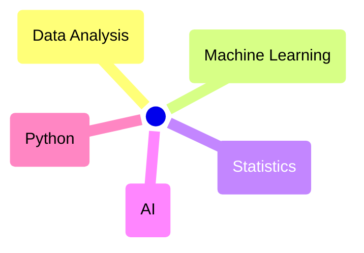

# Welcome!

Here’s some info about what I do in:

You can:

- Take a look at my [__works__](works/index.md)
- Know more [__about__](about.md) my background
- Visit my [:simple-github: __profile__](https://github.com/mikel-imaz){:target="_blank"} to learn about my stack