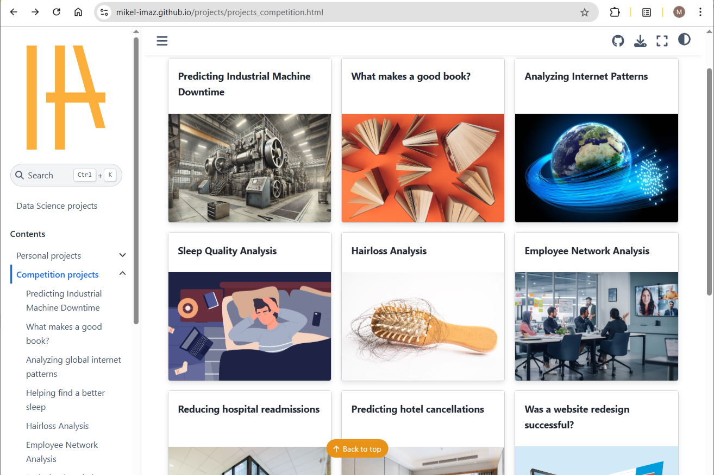

# Welcome!

-   [:octicons-pin-24: &nbsp; __Data Science projects__ ](https://mikel-imaz.github.io/projects){:target="_blank"}

    ---

    {:target="_blank"}

-   [&nbsp; __Projects__](projects.md)

    ---
    
    [:material-database-cog: &nbsp; Data Science](ds.md)

    [:material-robot: &nbsp; AI apps](ai.md)

    [:material-book-open-page-variant: &nbsp; Lectures](lectures.md)

    [:material-language-python: &nbsp; Python](python.md)

[:material-face-man: About me](about.md)  
[:material-github: GitHub profile](https://github.com/mikel-imaz){:target="_blank"}