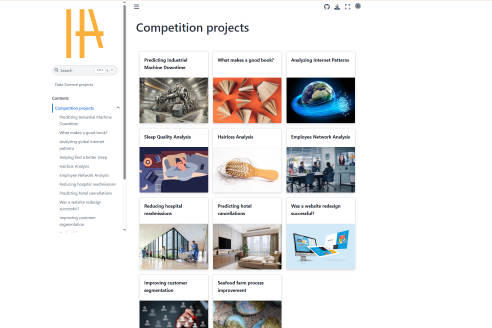

# Welcome to my works

-   [:material-book-open-page-variant: **Machine Learning concepts**](#)

    ---

    

    A course following Cassie Kozyrkov's [MFML](https://www.youtube.com/watch?v=1vkb7BCMQd0) talks

    ---

    En español

-   [:material-pine-tree: **Urban Tree Observatory**](https://www.omdena.com/chapter-challenges/urban-tree-observatory-data-driven-monitoring-conservation-in-ibague-colombia)

    ---

    

    Data-Driven Monitoring & Conservation in Ibagué, Colombia

    ---

    A [Omdena](https://www.omdena.com/chapter-challenges/urban-tree-observatory-data-driven-monitoring-conservation-in-ibague-colombia) colaboration

-   [:octicons-package-16: **Udalmap**](https://pypi.org/project/udalmap/)

    ---

    

    A Python package for easy access to data provided by [Udalmap](https://opendata.euskadi.eus/api-udalmap/?api=udalmap) web API

    ---

    Published on [:simple-pypi: PyPI](https://pypi.org/project/udalmap/)

-   [:octicons-beaker-16: **Data Science projects**](https://mikel-imaz.github.io/projects)

    ---

    

    My Data Science personal and competition projects, + some writings

    ---

    Bundled in a [:simple-jupyter:Jupyter-Book](https://mikel-imaz.github.io/projects)

