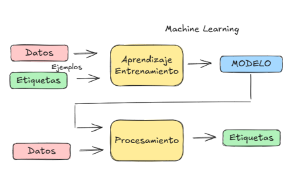

# :material-book-open-page-variant: &nbsp; Lectures

-   [__Curso de Machine Learning__](works/curso_ml.md)

    ---

    

-   [__Agentes de IA__: conceptos básicos](https://mikel-imaz.github.io/curso-ia){:target="_blank"}

    ---

    {:target="_blank"}

