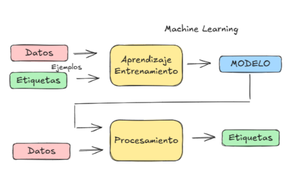

# :material-book-open-page-variant: &nbsp; Curso de Machine Learning

{:target="_blank"}

A conceptual course on Machine Learning following Cassie Kozyrkov's [MFML](https://www.youtube.com/watch?v=1vkb7BCMQd0){:target="_blank"} talks.  
En español

:material-calendar: &nbsp; 2025-05 (:material-arrow-right:)  
:material-link: &nbsp; [https://mikel-imaz.github.io/curso-ml](https://mikel-imaz.github.io/curso-ml/){:target="_blank"}(1)
{ .annotate }

1. :material-github: &nbsp; [https://github.com/mikel-imaz/curso-ml](https://github.com/mikel-imaz/curso-ml){:target="_blank"}

---

|subject|tasks|
|-|-|
|ML|Visual intuitive explanations, [:simple-excalidraw: Excalidraw](https://excalidraw.com/){:target="_blank"}|
|Course setup|Website with [:simple-materialformkdocs: Material for MkDocs](https://squidfunk.github.io/mkdocs-material/){:target="_blank"}|
|Slide-deck|:simple-markdown: -> HTML presentation with [Marp](https://marp.app/){:target="_blank"}|