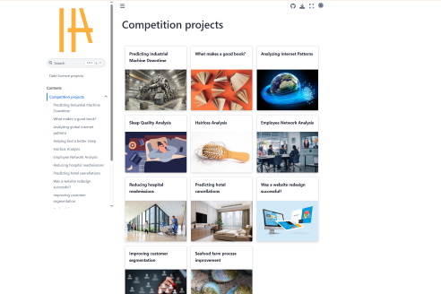

# Data Science projects

{:target="_blank"}

My Data Science personal and competition projects  + some writings  

:material-calendar: &nbsp; 2023-2025  
:material-link:  &nbsp; [https://mikel-imaz.github.io/projects](https://mikel-imaz.github.io/projects){:target="_blank"}(1)
{ .annotate }

1. :material-github: &nbsp; [https://github.com/mikel-imaz/projects](https://github.com/mikel-imaz/projects){:target="_blank"}

---

|subject|tasks|
|-|-|
|Website|Projects organized in a [:simple-jupyter:Jupyter-Book](https://jupyterbook.org/en/stable){:target="_blank"}|
|Competition|[:simple-datacamp: DataCamp](https://datacamp.com){:target="_blank"}|
|Personal|Everyday life Data Science projects|