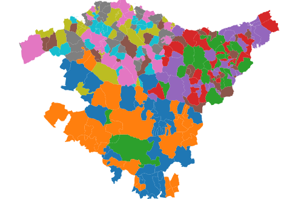

# Udalmap API wrapper

A Python package for easy access to data provided by [Udalmap](https://opendata.euskadi.eus/api-udalmap/?api=udalmap) web API

:material-calendar: &nbsp; 2025-03  
:material-link:  &nbsp; [https://pypi.org/project/udalmap](https://pypi.org/project/udalmap/)(1)
{ .annotate }

1. :material-github: &nbsp; [https://github.com/mikel-imaz/udalmap](https://github.com/mikel-imaz/udalmap)

---

|subject|tasks|
|-|-|
|Python package|OOP, [PyPI :simple-pypi:](https://pypi.org/project/udalmap)|
|Code testing|Unit testing, CI with GitHub Actions|
|Documentation|:simple-sphinx: Sphinx ([automatic](https://mikel-imaz.github.io/udalmap/) with docstrings)|