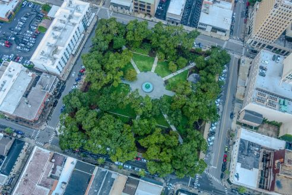

# Urban Tree Observatory
  

Data-Driven Monitoring & Conservation in Ibagué, Colombia  
A [__Omdena__](https://www.omdena.com) colaboration

:material-calendar: &nbsp; 2025-04  
:material-link:  &nbsp; [https://www.omdena.com/chapter-challenges/urban-tree-observatory-data-driven-monitoring-conservation-in-ibague-colombia](https://www.omdena.com/chapter-challenges/urban-tree-observatory-data-driven-monitoring-conservation-in-ibague-colombia)(1)
{ .annotate }

1. :material-github: &nbsp; [https://github.com/OmdenaAI/GibdetColombiaChapter_UrbanTreeObservatory](https://github.com/OmdenaAI/GibdetColombiaChapter_UrbanTreeObservatory)

---

|subject|tasks|
|-|-|
|Satellite imagery|GIS, processing of vector and raster files in Python|
|Canopy Height Maps|[:simple-meta:](https://sustainability.atmeta.com/blog/2024/04/22/using-artificial-intelligence-to-map-the-earths-forests/) &nbsp; :point_right: [example project](https://mikel-imaz.github.io/projects/notebooks/chm.html)|
|Land Cover Maps|[:simple-googleearthengine: Google Earth Engine](https://earthengine.google.com/). &nbsp; :point_right: [example project](https://mikel-imaz.github.io/projects/notebooks/land_cover.html)|