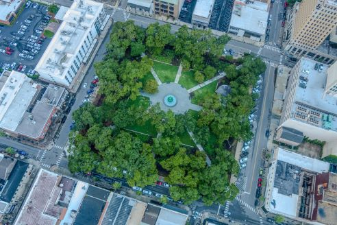

# Urban Tree Observatory

Data-Driven Monitoring & Conservation in Ibagué, Colombia: A [Omdena](https://www.omdena.com){:target="_blank"} colaboration

:material-calendar: &nbsp; 2025-04  
:material-link:  &nbsp; [https://www.omdena.com/chapter-challenges/urban-tree-observatory-data-driven-monitoring-conservation-in-ibague-colombia](https://www.omdena.com/chapter-challenges/urban-tree-observatory-data-driven-monitoring-conservation-in-ibague-colombia){:target="_blank"}(1)
{ .annotate }

1. :material-github: &nbsp; [https://github.com/OmdenaAI/GibdetColombiaChapter_UrbanTreeObservatory](https://github.com/OmdenaAI/GibdetColombiaChapter_UrbanTreeObservatory){:target="_blank"}

---