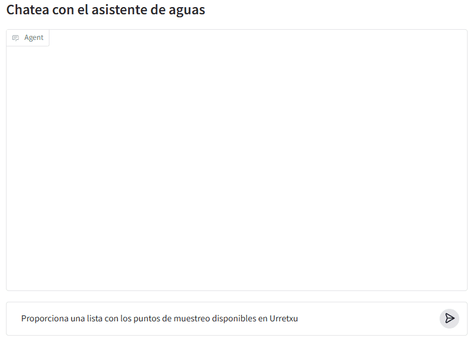
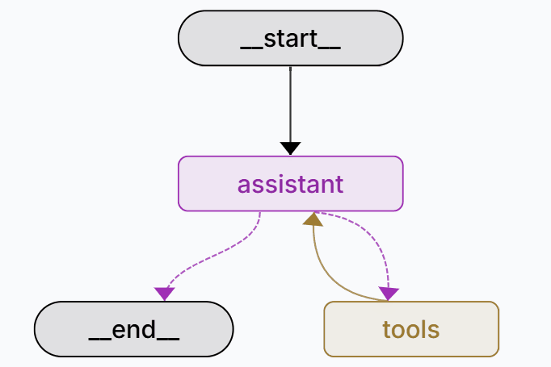

# Uredan

Agente de IA para acceder a la información proporcionada por la API de la [Red de Control y Vigilancia de las aguas de consumo de Euskadi](https://www.euskadi.eus/informacion/red-de-control-y-vigilancia-de-las-aguas-de-consumo-de-euskadi/web01-a3aguas/es/).

:material-calendar: &nbsp; 2025-09  
:material-link: &nbsp; [https://huggingface.co/spaces/da7uak/uredan](https://huggingface.co/spaces/da7uak/uredan)(1)
{ .annotate }

1. :material-github: &nbsp; [https://github.com/mikel-imaz/uredan](https://github.com/mikel-imaz/uredan)

---

AI agent built in :simple-langgraph: Langraph.

